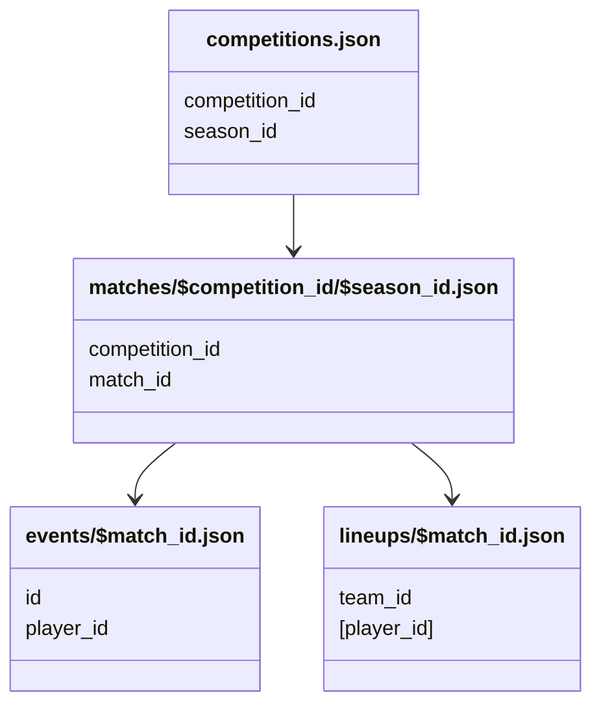
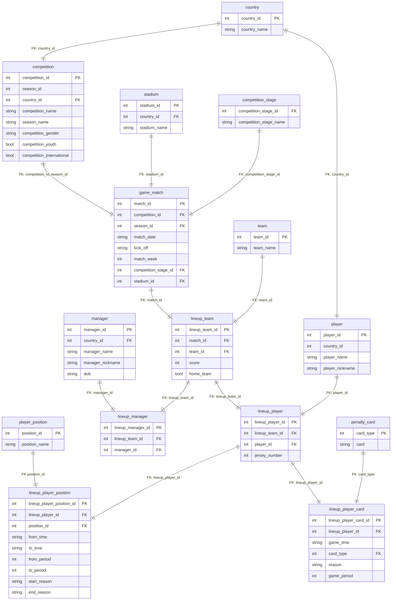

### JSON Mapping

```mermaid
classDiagram
		class competitions ["competitions.json"]{
        competition_id
        season_id
    }
    
    class matches["matches/$competition_id/$season_id.json"]{
        competition_id
        match_id
    }
    
    class events ["events/$match_id.json"] {
    		id
    		player_id
    }
    
    class lineups ["lineups/$match_id.json"] {
    		team_id
    		[player_id]
    }

	competitions --> matches
	matches --> events
	matches --> lineups
```

### Database Mapping

```mermaid
erDiagram
	country {
		int country_id PK
		string country_name
	}
	
	competition {
		int competition_id PK
		int season_id
		int country_id FK
		string competition_name
		string season_name
		string competition_gender
		bool competition_youth
				bool competition_international
	}
	
	stadium {
			int stadium_id PK
			int country_id FK
			string stadium_name
	}
	
	manager {
			int manager_id PK
			int country_id FK
			string manager_name
			string manager_nickname
			string dob
	}
	
	competition_stage {
			int competition_stage_id FK
			string competition_stage_name
	}
	
	game_match {
			int match_id PK
			int competition_id FK
			int season_id FK
				string match_date
				string kick_off
				int match_week
				int competition_stage_id FK
				int stadium_id FK
	}
   
	
	team {
			int team_id PK
			string team_name
	}
	
	player_position {
			int position_id PK
			string position_name
	}
	
	lineup_team {
			int lineup_team_id PK
			int match_id FK
			int team_id FK
			int score
			bool home_team
	}
	
	lineup_player {
		int lineup_player_id PK
		int lineup_team_id FK
		int player_id FK
		int jersey_number
	}
	
	lineup_manager {
		int lineup_manager_id PK
		int lineup_team_id FK
		int manager_id FK
	}
	
	lineup_player_position {
			int lineup_player_position_id PK
			int lineup_player_id FK
			int position_id FK
			string from_time
			string to_time
			int from_period
			int to_period
			string start_reason
			string end_reason
	}
	
	penalty_card {
			int card_type PK
			string card
	}
	
	lineup_player_card {
			int lineup_player_card_id PK
			int lineup_player_id FK
			string game_time
			int card_type FK
			string reason
			int game_period
	}
	
	player {
			int player_id PK
			int country_id
			string player_name
			string player_nickname
	}
	
	
	lineup_team ||--|| lineup_manager : "FK: lineup_team_id"
	team ||--|| lineup_team : "FK: team_id"
	lineup_team ||--|| lineup_player : "FK: lineup_team_id"
	country ||--|| competition : "FK: country_id"
	competition ||--|| game_match : "FK: competition_id, season_id"
	stadium  ||--|| game_match : "FK: stadium_id"
	competition_stage  ||--|| game_match : "FK: competition_stage_id"
  manager  ||--|| lineup_manager : "FK: manager_id"
	game_match ||--|| lineup_team : "FK: match_id" 
	lineup_player ||--||	lineup_player_position : "FK: lineup_player_id"
	player_position ||--|| lineup_player_position : "FK position_id"
	lineup_player ||--||	lineup_player_card : "FK: lineup_player_id"
	penalty_card ||--|| lineup_player_card : "FK: card_type"
	player ||--||	lineup_player : "FK: player_id"
	country ||--||	player : "FK: country_id"
	
```

