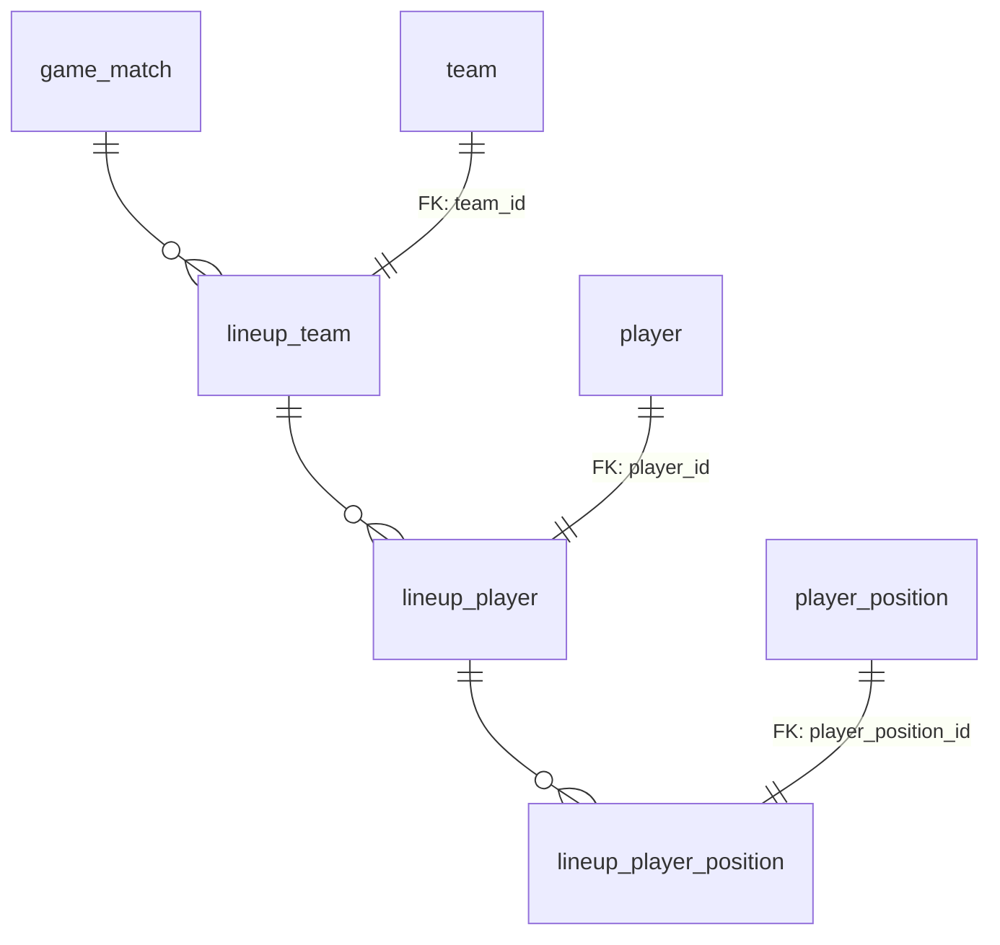
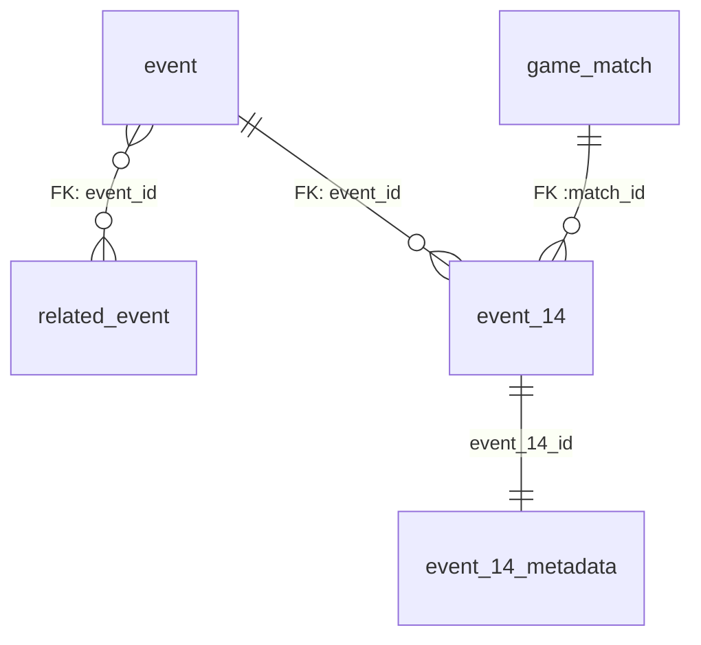
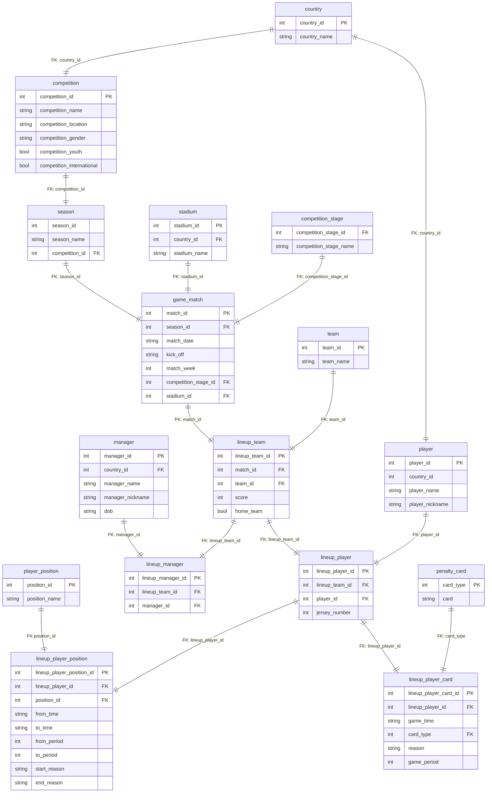
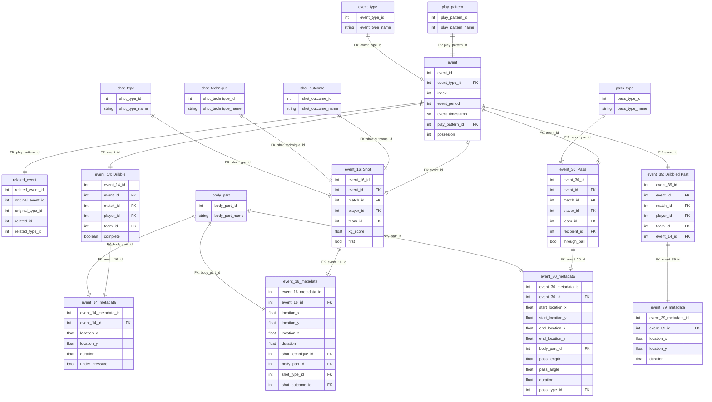

# Soccer Database

```
Abdullah Mostafa
101008311
COMP 3005
```

## Conceptual Design

The schema can be broken down into 3 different aspects:

1.  **Key entities**: These are tables that store general data that are used and referenced throughout the rest of the database such as Teams, Players, Countries, Season, Matches etc.
2.  **Events data tables**: These tables contain the necessary data needed to conduct queries. For example table `event_16` which contains Shot events data.
3.  **Events metadata tables**: These tables contain auxiliary to the events data table, these contain information that isn't always needed in the usual queries but is ready and accessible when needed. The events data is split up into these two categories to optimize for lookup efficiency. For example: `event_16_metadata` contains additional info to each event in `event_16` table and can be looked up through a FK pointing to the `event_16_id`.


Soccer teams can be very dynamic, in one season a player x can be team A, and in the next can be on team B. Alternatively the same player can play different positions and have different jersey numbers across different matches. By this nature you cannot tie a player to a team, nor give him a fixed position or jersey number. To combat this, the `player` table only contains fixed info on a player such as their name and their nationality and an id. Likewise the `team` table only has a team name and a team id. A set of intermediary tables starting with the name `lineup_*` links players to teams and teams to matches. These `lineup_*` tables hold match specific information on a team, player etc. For example `lineup_team` holds the team's score, and if they're the home team. The `lineup_player` hold the jersey number and is associated to a `lineup_team` which can retrieve the team's line up for that match. Moreover `lineup_player_poisiton`  is associated to a `lineup_player`, a player can have multiple positions throughout a match and each entry in this table reflects that. This is a simplified subset of the ER diagram of how the game-team-player associations work:




The event table design is broken into 3 aspects, there is one main table `event` that contains all the events. This table holds general attributes shared across each event such as the type of event, timestamp, play style etc. There is a `related_event` table which holds record of an event's related event ids, if an event has multiple then there will be multiple entries (one for each related event). Each specific event type is broken out into their own specific tables, this is done this way as different event types have different attributes, this also significantly speeds up query times when you are only interested in one event type. Some event (events 14, 16, 30 and 39) have an auxiliary table called `event_#_metadata` which is associated to its respective `event_#` table through a FK, this is done to increase query efficiency as the tables for events 14, 16, 30 and 39 only store the necessary information for the queries, meanwhile their respective auxiliary tables contain the rest of the data of the event.




### Cardinalities:

1. One to many: `country`, `stadium`, `competition`,`season`, `game_match`, `team_lineup`, `player_position`, `event_type`, `play_pattern`, `events` etc.. are all one to many as entities that contain these will only contain one. For example a stadium can only have 1 country, a match can only have 1 season, a season can only have 1 competition,  and so on.
1. Many to many: `team`, `player`, `manager`, `related_event` etc, these entities are many to many as many teams can have many players, etc

## Relation Schemas

- **country**: 
  - `country_id` (PK), `country_name`
- **player**: Player, their country and nicknames
  - `player_id` (PK), `player_name`, `player_nickname`, `country_id` (FK)
- **manager**: Managers
  - `manager_id` (PK), `manager_name`, `manager_nickname`, `dob`, `country_id `(FK)
- **stadium**: Stadium name and country
  - `stadium_id` (PK), `stadium_name`, `country_id` (FK)
- **competition_stage**: 
  - `competition_stage_id` (FK), `competition_stage_name`
- **competition**: 
  - `competition_id` (PK), `competition_name`, `location`, `gender`, `youth`, `international`
- **season**: season data, associated to a competition through FK
  - `season_id` (PK), `season_name`, `competition_id` (FK)
- **game_match**: match data, associated to a season through FK
  - `match_id` (PK), `season_id` (FK), `competition_stage_id` (FK), `stadium_id` (FK), `match_date`, `kick_off`, `match_week`
- **team**: 
  - `team_id` (PK), `team_name`
- **player_position**: 
  - `position_id` (PK), `position_name`
- **lineup_team**: Associated to a **game_match**. Each match has two teams, **lineup_team** stores what the team scored that game and if that team is the home team. A **lineup_team** is associated to a team through the `team_id` FK, this is done this way as different teams can yield different scores, teams can also vary between being home team and away team in different matches, thus this intermediate table links a team along with a match. A lineup_team entry is just a name, the **lineup_team** is what contains all the players for that game.
  - `lineup_team_id` (PK), `match_id` (FK), `team_id` (FK), `score`, `home_team`
- **lineup_player**: Associated to a `lineup_team`, this is done this way as teams can have different players each match, the same player could have different jersey number across different match etc. This intermediate table lets us map 
  - `lineup_player_id` (PK), `lineup_team_id` (FK), `player_id` (FK), `jersey_number`
- **lineup_player_position**: 
  - `lineup_player_position_id` (PK), `lineup_player_id` (FK), `position_id` (FK), `from_time`, `to_time`, `from_period`, `to_period`, `start_reason`, `end_reason`
- **lineup_manager**: Similar to how a **lineup_player** is linked to a **lineup_team_id** which is linked to a **game_match**.
    - `lineup_manager_id` (PK), `lineup_team_id` (FK), `manager_id` (FK)
- **penalty_card**: 
  - `card_type` (PK), `card`
- **lineup_player_card**: Associated to a **lineup_player** and explains when and why they got the card
  - `lineup_player_card_id` (PK), `lineup_player_id` (FK), `game_time`, `card_type` (FK), `reason`, `game_period`
- **event_type**: 
  - `event_type_id` (PK), `event_type_name`
- **play_pattern**: 
  - `play_pattern_id` (PK), `play_pattern_name`
- **pass_type**: 
  - `pass_type_id` (PK), `pass_type_name`
- **event**: Stores basic info on every event
  - `event_id` (PK), `event_type_id` (FK), `event_index`, `event_period`, `event_timestamp`, `play_pattern_id` (FK), `possession`
- **related_event**: You can find an event's related events in this table
  - `related_event_id` (PK), `original_event_id` (FK), `original_type_id` (FK), `related_id` (FK), `related_type_id` (FK)
- **event_14**: Dribble event
  - `event_14_id` (PK), `event_id` (FK), `match_id` (FK), `player_id` (FK), `team_id` (FK), `complete`
- **event_16**: Shot event
  - ``event_16_id` (PK), `event_id` (FK), `match_id` (FK), `player_id` (FK), `team_id` (FK), `xg_score`, `first_time``
- **event_30**: Pass event
  - `event_30_id` (PK), `event_id` (FK), `match_id` (FK), `player_id` (FK), `team_id` (FK), `recipient_id` (FK), `through_ball`
- **event_39**: Dribbled Past event
  - `event_39_id` (PK), `event_id` (FK), `match_id` (FK), `player_id` (FK), `team_id` (FK), `event_14_id` (FK), `completed_dribble`

### 

## Database Schema Diagram



### Event Tables



