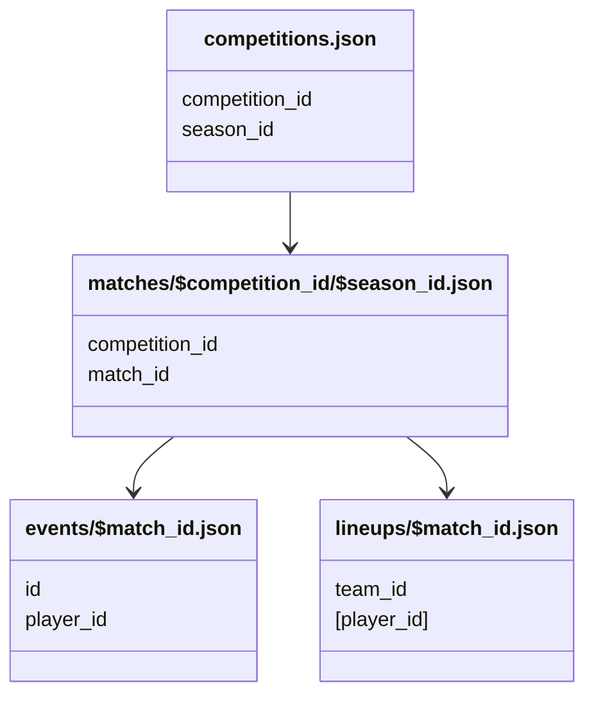
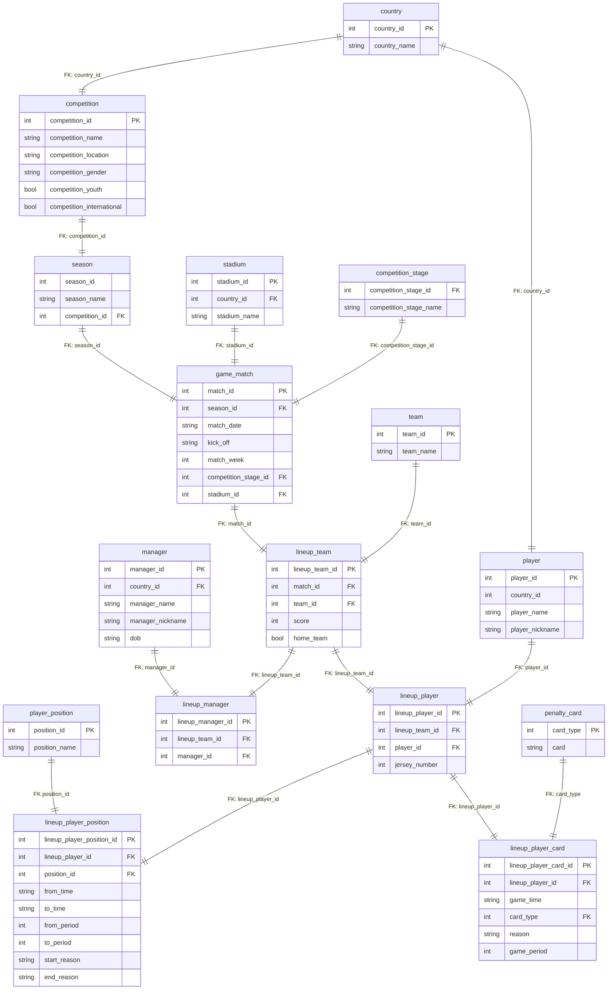
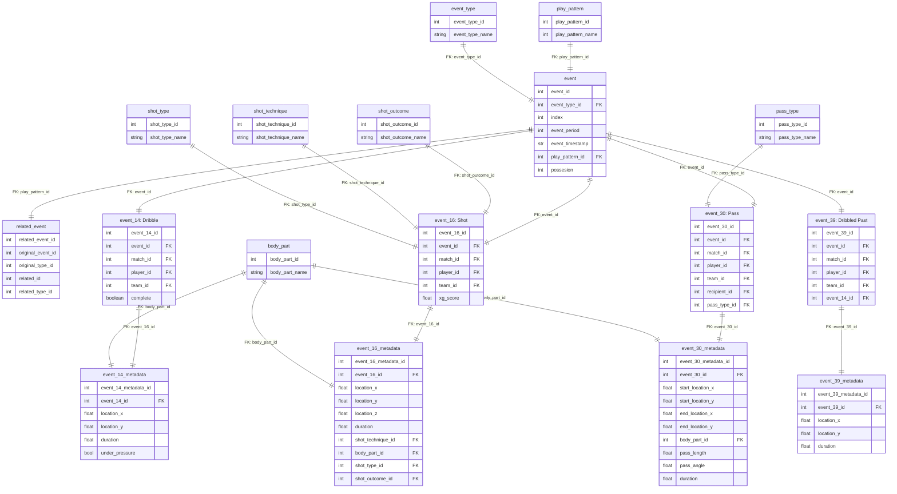

### JSON Mapping

```mermaid
classDiagram
		class competitions ["competitions.json"]{
        competition_id
        season_id
    }
    
    class matches["matches/$competition_id/$season_id.json"]{
        competition_id
        match_id
    }
    
    class events ["events/$match_id.json"] {
    		id
    		player_id
    }
    
    class lineups ["lineups/$match_id.json"] {
    		team_id
    		[player_id]
    }

	competitions --> matches
	matches --> events
	matches --> lineups
```

### Database Mapping

```mermaid
erDiagram
	country {
		int country_id PK
		string country_name
	}
	
	competition {
		int competition_id PK
		string competition_name
		string competition_location
		string competition_gender
		bool competition_youth
		bool competition_international
	}
	
	season {
			int season_id
			string season_name
			int competition_id FK
	}
	
	stadium {
			int stadium_id PK
			int country_id FK
			string stadium_name
	}
	
	manager {
			int manager_id PK
			int country_id FK
			string manager_name
			string manager_nickname
			string dob
	}
	
	competition_stage {
			int competition_stage_id FK
			string competition_stage_name
	}
	
	game_match {
			int match_id PK
			int season_id FK
				string match_date
				string kick_off
				int match_week
				int competition_stage_id FK
				int stadium_id FK
	}
   
	
	team {
			int team_id PK
			string team_name
	}
	
	player_position {
			int position_id PK
			string position_name
	}
	
	lineup_team {
			int lineup_team_id PK
			int match_id FK
			int team_id FK
			int score
			bool home_team
	}
	
	lineup_player {
		int lineup_player_id PK
		int lineup_team_id FK
		int player_id FK
		int jersey_number
	}
	
	lineup_manager {
		int lineup_manager_id PK
		int lineup_team_id FK
		int manager_id FK
	}
	
	lineup_player_position {
			int lineup_player_position_id PK
			int lineup_player_id FK
			int position_id FK
			string from_time
			string to_time
			int from_period
			int to_period
			string start_reason
			string end_reason
	}
	
	penalty_card {
			int card_type PK
			string card
	}
	
	lineup_player_card {
			int lineup_player_card_id PK
			int lineup_player_id FK
			string game_time
			int card_type FK
			string reason
			int game_period
	}
	
	player {
			int player_id PK
			int country_id
			string player_name
			string player_nickname
	}
	
	
	lineup_team ||--|| lineup_manager : "FK: lineup_team_id"
	team ||--|| lineup_team : "FK: team_id"
	lineup_team ||--|| lineup_player : "FK: lineup_team_id"
	country ||--|| competition : "FK: country_id"
	competition ||--|| season : "FK: competition_id"
	season ||--|| game_match : "FK: season_id"
	stadium  ||--|| game_match : "FK: stadium_id"
	competition_stage  ||--|| game_match : "FK: competition_stage_id"
  manager  ||--|| lineup_manager : "FK: manager_id"
	game_match ||--|| lineup_team : "FK: match_id" 
	lineup_player ||--||	lineup_player_position : "FK: lineup_player_id"
	player_position ||--|| lineup_player_position : "FK position_id"
	lineup_player ||--||	lineup_player_card : "FK: lineup_player_id"
	penalty_card ||--|| lineup_player_card : "FK: card_type"
	player ||--||	lineup_player : "FK: player_id"
	country ||--||	player : "FK: country_id"
	
```

### Event Tables

```mermaid
%% Tables for events
	erDiagram
	event_type {
		int event_type_id
		string event_type_name
	}
	
	play_pattern {
		int play_pattern_id
		int play_pattern_name
	}
	
	event { 
		int event_id
		int event_type_id FK
		int index
		int event_period
		str event_timestamp
		int play_pattern_id FK
		int possesion
	}
	
	related_event {
		int related_event_id
		int original_event_id
		int original_type_id
		int related_id
		int related_type_id
	}
	
	body_part{
		int body_part_id
		string body_part_name
	}
	
	body_part ||--|| event_14_metadata : "FK: body_part_id"
	
	%% Event 14: Dribble
	event_14 ["event_14: Dribble"]{
		int event_14_id
		int event_id FK
		int match_id FK
		int player_id FK
		int team_id FK
		boolean complete
	}
	
	event_14_metadata {
		int event_14_metadata_id
		int event_14_id FK
		float location_x
		float location_y
		float duration
		bool under_pressure
	}
	
	%% Event 16: Shot
	event_16 ["event_16: Shot"]{
		int event_16_id
		int event_id FK
		int match_id FK
		int player_id FK
		int team_id FK
		float xg_score
	}
	
	event_16_metadata {
		int event_16_metadata_id
		int event_16_id FK
		float location_x
		float location_y
		float location_z
		float duration
		int shot_technique_id FK
		int body_part_id FK
		int shot_type_id FK
		int shot_outcome_id FK
	}
	
	shot_type {
		int shot_type_id
		string shot_type_name
	}
	
	shot_technique {
		int shot_technique_id
		string shot_technique_name
	}
	
	shot_outcome {
		int shot_outcome_id
		string shot_outcome_name
	}
	body_part ||--|| event_16_metadata : "FK: body_part_id"
	shot_type ||--|| event_16 : "FK: shot_type_id"
	shot_technique ||--|| event_16 : "FK: shot_technique_id"
	shot_outcome ||--|| event_16 : "FK: shot_outcome_id"
	
	%% Event 30: Pass
	event_30 ["event_30: Pass"]{
		int event_30_id
		int event_id FK
		int match_id FK
		int player_id FK
		int team_id FK
		int recipient_id FK
		int pass_type_id FK
	}
	
	event_30_metadata {
		int event_30_metadata_id
		int event_30_id FK
		float start_location_x
		float start_location_y
		float end_location_x
		float end_location_y
		int body_part_id FK
		float pass_length
		float pass_angle
		float duration
	}
	
	pass_type {
		int pass_type_id
		string pass_type_name
	}
	
	body_part ||--|| event_30_metadata : "FK: body_part_id"
	pass_type ||--|| event_30 : "FK: pass_type_id"
	
	%% Event 39: Dribbled Past
	event_39 ["event_39: Dribbled Past"]{
		int event_39_id
		int event_id FK
		int match_id FK
		int player_id FK
		int team_id FK
		int event_14_id FK
	}
	
	event_39_metadata {
		int event_39_metadata_id
		int event_39_id FK
		float location_x
		float location_y
		float duration
	}
	
	event_type ||--|| event : "FK: event_type_id"
	play_pattern ||--|| event : "FK: play_pattern_id"
	event ||--|| related_event : "FK: play_pattern_id"
	
	event_14 ||--|| event_14_metadata : "FK: event_16_id"
	event_16 ||--|| event_16_metadata : "FK: event_16_id"
	event_30 ||--|| event_30_metadata : "FK: event_30_id"
	event_39 ||--|| event_39_metadata : "FK: event_39_id"

	%%event_14 ||--|| event_39 : "FK: event_id"
	

	event ||--|| event_14 : "FK: event_id"
	event ||--|| event_16 : "FK: event_id"
	event ||--|| event_30 : "FK: event_id"
	event ||--|| event_39 : "FK: event_id"
	
	
	
	
```

